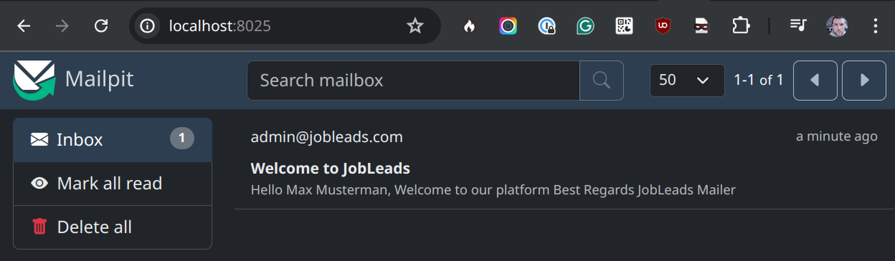

# Test Assessment

This is a test assessment to be presented to the candidates for the PHP Developer position.
It has some missing parts that need to be implemented during the live coding session.

## Pre-requirements

- Docker with compose plugin
- Make

## Stack:

- PHP 8.3
- Postgres 13
- Symfony 6.4
- Swagger UI
- Symfony/Mailer
- Twig
- PHPUnit
- Doctrine ORM
- Zenstruck/Foundry
- FOS/RestBundle

## Installation

```bash
make up && make fixtures
```

Check docker-compose files to know which services are exposed.

## Running tests

```bash
make test

PHPUnit 9.6.20 by Sebastian Bergmann and contributors.

Testing 
Customer Controller (App\Test\Controller\CustomerController)
 ✔ Index
 ✔ New
 ✔ Show

Customer Registration Service (App\Test\Unit\CustomerRegistrationService)
 ☢ Register
 ✔ Integration

Time: 00:02.635, Memory: 66.50 MB

Summary of non-successful tests:

Customer Registration Service (App\Test\Unit\CustomerRegistrationService)
 ☢ Register
```

## Logging into PHP container shell:

```
make bash
```

## testing APIs with swagger

```
https://localhost/doc
```
You can use `login_check` endpoint to get the token that you can paste into authorize modal - see the screenshot below


You can use swagger UI for verifying some of the future task steps like creating a new customer and receiving an email

## Virtual mailbox:

Visit http://localhost:8025



## Knowledge required:

- defining services in Symfony
- writing unit tests / functional tests in Symfony
- using the mail component in Symfony
- using twig as a service
- using param converters in symfony
- using maker bundle in Symfony
- creating entities / using repositories
- basic understanding of FOSRestBundle
- how to validate data in symfony
- using zenstruck foundry for fixtures and entity factories

## Tasks:

**Think about the most basic POC solution for any given task.**

If you got any improvements/followups to the initial solution you can mention

**The goal is not to spend too much time on each task but to show a basic understanding of the topic.**

Ensure that you save each step as a dedicated commit for ex `git commit -am "Step 1: Introduce a customer registration service"` 

1. Introduce a customer registration service that is responsible for inserting into DB and  **sending an email** every time a new customer is registered.
2. Implement/fix unit test for checking new functionality `CustomerRegistrationServiceTest.php`
3. Write the content of the mail we send to the customer after registration into a dedicated database table
    - To login into php container use `make bash`
4. Introduce a dedicated controller with path `/mail/{id}` for showing the email content in the browser (in case the mail client is not able to render HTML)
    - Use Swagger UI at `/api/doc` for creating new customer to verify then the newly created mail log entry by ID
5. Ensure that there is a proper functional test for the new controller (new integration test)


## Hints:

- See how Symfony can verify sending mails in test environment
# Test Assessment

This is a test assessment to be presented to the candidates for the PHP Developer position.
It has some missing parts that need to be implemented during the live coding session.

## Pre-requirements

- Docker with compose plugin
- Make

## Stack:

- PHP 8.3
- Postgres 13
- Symfony 6.4
- Swagger UI
- Symfony/Mailer
- Twig
- PHPUnit
- Doctrine ORM
- Zenstruck/Foundry
- FOS/RestBundle

## Installation

```bash
make up && make fixtures
```

Check docker-compose files to know which services are exposed.

## Running tests

```bash
make test

PHPUnit 9.6.20 by Sebastian Bergmann and contributors.

Testing 
Customer Controller (App\Test\Controller\CustomerController)
 ✔ Index
 ✔ New
 ✔ Show

Customer Registration Service (App\Test\Unit\CustomerRegistrationService)
 ☢ Register
 ✔ Integration

Time: 00:02.635, Memory: 66.50 MB

Summary of non-successful tests:

Customer Registration Service (App\Test\Unit\CustomerRegistrationService)
 ☢ Register
```

## Logging into PHP container shell:

```
make bash
```

## testing APIs with swagger

```
https://localhost/doc
```
You can use `login_check` endpoint to get the token that you can paste into authorize modal - see the screenshot below


You can use swagger UI for verifying some of the future task steps like creating a new customer and receiving an email

## Virtual mailbox:

Visit http://localhost:8025


## Knowledge required:

- defining services in Symfony
- writing unit tests / functional tests in Symfony
- using the mail component in Symfony
- using twig as a service
- using param converters in symfony
- using maker bundle in Symfony
- creating entities / using repositories
- basic understanding of FOSRestBundle
- how to validate data in symfony
- using zenstruck foundry for fixtures and entity factories

## Tasks:

**Think about the most basic POC solution for any given task.**

If you got any improvements/followups to the initial solution you can mention

**The goal is not to spend too much time on each task but to show a basic understanding of the topic.**

Ensure that you save each step as a dedicated commit for ex `git commit -am "Step 1: Introduce a customer registration service"` 

1. Introduce a customer registration service that is responsible for inserting into DB and  **sending an email** every time a new customer is registered.
2. Implement unit test in empty method block and fix functiona test for inside of `CustomerRegistrationServiceTest.php`
3. Write the content of the mail we send to the customer after registration into a dedicated database table
    - To login into php container use `make bash`
4. Introduce a dedicated controller with path `/mail/{id}` for showing the email content in the browser (in case the mail client is not able to render HTML)
    - Use Swagger UI at `/api/doc` for creating new customer to verify then the newly created mail log entry by ID
5. Ensure that there is a proper functional test for the new controller (new integration test)


## Hints:

- See how Symfony can verify sending mails in test environment
